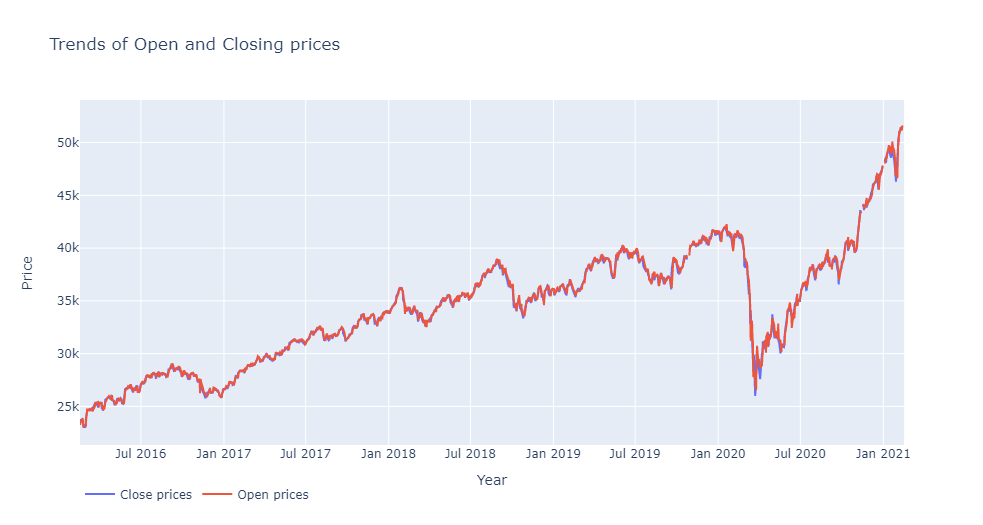

# Stock Market Prediction using  Numerical and Textual Analysis
## Objective
### Create a hybrid model for stock price/performance  prediction using numerical analysis of historical stock prices, and  sentimental analysis of news headlines  


<!-- PROJECT SHIELDS -->
[![Contributors][contributors-shield]][contributors-url]
[![Issues][issues-shield]][https://github.com/divinit7/Stock_market_Price/issues]
[![LinkedIn][linkedin-shield]][https://www.linkedin.com/in/divyanshu-chauhan-6858b9194]


<!-- PROJECT LOGO -->
<br />
<p align="center">
  <a href="https://github.com/divinit7/Stock_market_Price/">
    
  </a>

  <h3 align="center">Best-README-Template</h3>

  <p align="center">
    An awesome README template to jumpstart your projects!
    <br />
    <a href="https://github.com/othneildrew/Best-README-Template"><strong>Explore the docs »</strong></a>
    <br />
    <br />
    <a href="https://github.com/divinit7/Stock_market_Price/blob/main/News%20based%20stock%20price%20prediction.ipynb">View Notebook</a>
    ·
    <a href="https://github.com/divinit7/Stock_market_Price/issues">Report Bug</a>
    ·
    <a href="https://github.com/divinit7/Stock_market_Price/issues">Request Feature</a>
  </p>
</p>


<!-- TABLE OF CONTENTS -->
<details open="open">
  <summary>Table of Contents</summary>
  <ol>
    <li>
      <a href="#about-the-project">About The Project</a>
      <ul>
        <li><a href="#built-with">Built With</a></li>
      </ul>
    </li>
    <li>
      <a href="#getting-started">Getting Started</a>
      <ul>
        <li><a href="#prerequisites">Prerequisites</a></li>
        <li><a href="#installation">Installation</a></li>
      </ul>
    </li>
    <li><a href="#roadmap">Roadmap</a></li>
    <li><a href="#contributing">Contributing</a></li>
    <li><a href="#contact">Contact</a></li>
    <li><a href="#acknowledgements">Acknowledgements</a></li>
  </ol>
</details>


<!-- ABOUT THE PROJECT -->
## About The Project
Create a hybrid model for stock price/performance  prediction using numerical analysis of historical stock prices, and  sentimental analysis of news headlines
[![][Sensex-through-the-years]](https://github.com/divinit7/Stock_market_Price/newplot.png)


### Built With

* [LightGBM](https://lightgbm.readthedocs.io/en/latest/)
* [Sklearn](https://scikit-learn.org/)
* [Project Jupyter](https://jupyter.org/)


<!-- GETTING STARTED -->
## Getting Started


### Prerequisites

This is an example of how to list things you need to use the software and how to install them.
* Clone and open the jupyter notebook
  ```sh
  git clone https://github.com/divinit7/Stock_market_Price.git
   ```

### Installation

1. Clone the repo
   ```sh
   git clone https://github.com/divinit7/Stock_market_Price.git
   ```


<!-- ROADMAP -->
## Roadmap

See the [open issues](https://github.com/divinit7/Stock_market_Price/issues) for a list of proposed features (and known issues).


<!-- CONTRIBUTING -->
## Contributing

Contributions are what make the open source community such an amazing place to be learn, inspire, and create. Any contributions you make are **greatly appreciated**.

1. Fork the Project
2. Create your Feature Branch (`git checkout -b feature/AmazingFeature`)
3. Commit your Changes (`git commit -m 'Add some AmazingFeature'`)
4. Push to the Branch (`git push origin feature/AmazingFeature`)
5. Open a Pull Request


<!-- CONTACT -->
## Contact

Divyanshu Chauhan - chauhandivyanshu14@gmail.com

Project Link: [https://github.com/divinit7/Stock_market_Price/](https://github.com/divinit7/Stock_market_Price/)


<!-- ACKNOWLEDGEMENTS -->
## Acknowledgements
* [GitHub Emoji Cheat Sheet](https://www.webpagefx.com/tools/emoji-cheat-sheet)


